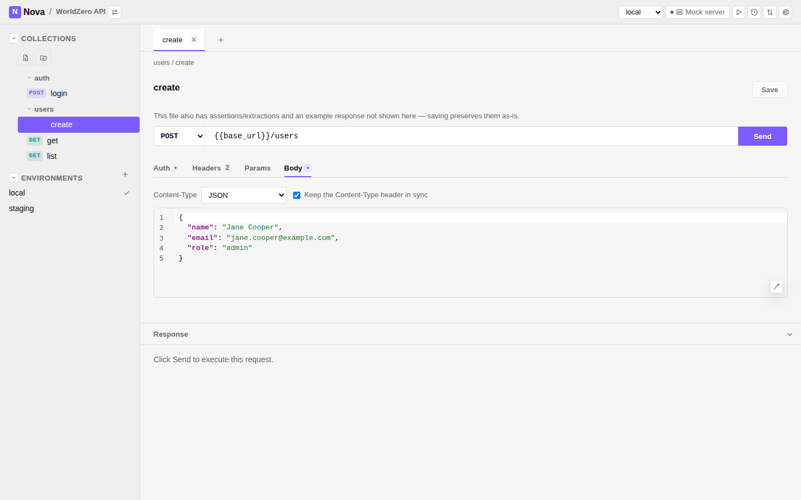
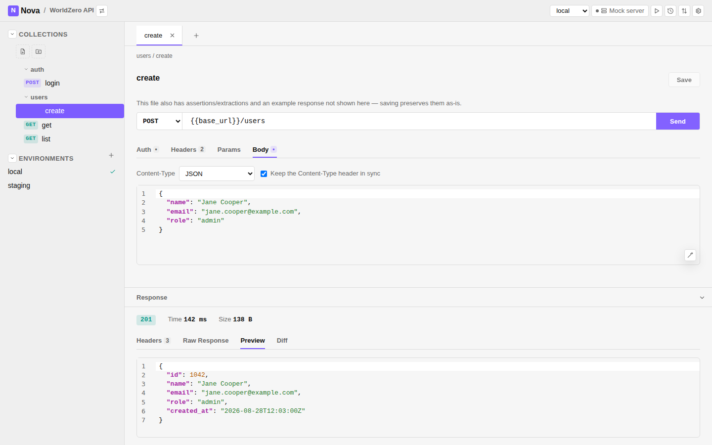
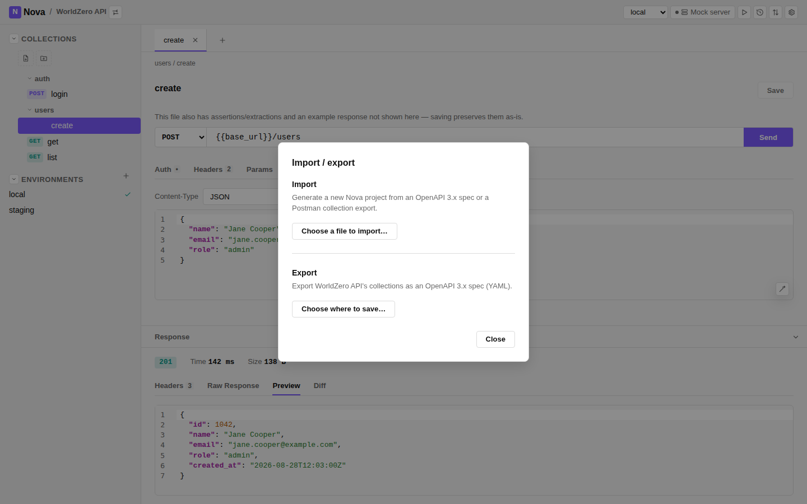
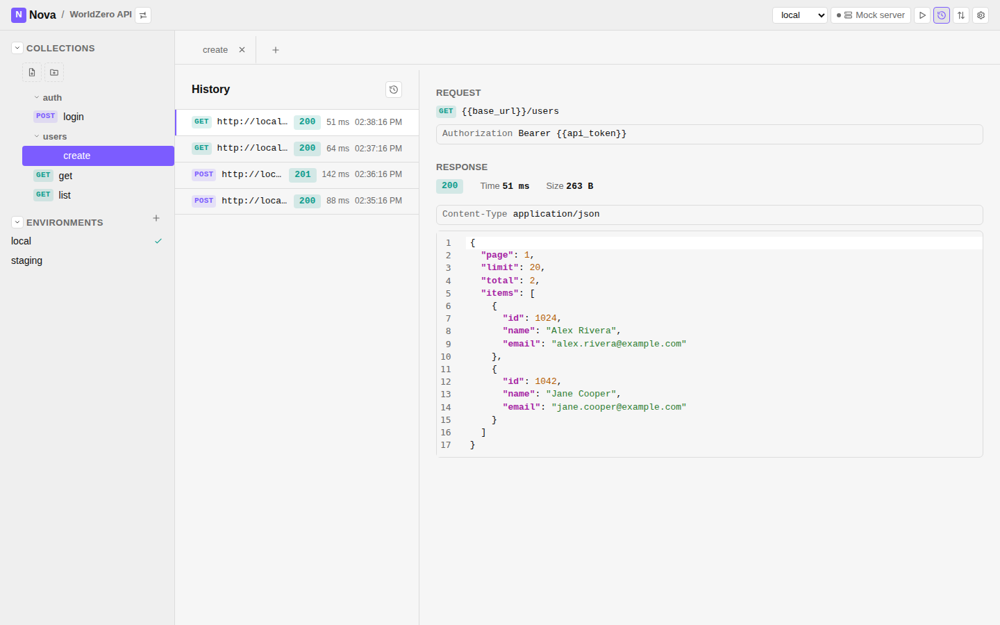

# Nova

Nova is an open-source, local-first, Git-native API development client.

> **API requests are project artifacts. They should live with the code.**

Modern API clients organize requests around proprietary cloud workspaces,
accounts, invitations, and synchronization layers. Nova treats API
definitions as plain, human-readable files that live in your repo and go
through the same Git workflow as everything else.

```text
my-project/
├── src/
├── nova/
│   ├── collections/
│   │   ├── auth/login.nova
│   │   └── users/create.nova
│   └── envs/
│       ├── local.yaml
│       └── staging.yaml
└── nova.yaml
```

Clone the repo and you have the API workspace. No account. No workspace
invitation. No exporting/importing collections between team members.

**Git is the collaboration system.**

## Screenshots

<table>
  <tr>
    <td></td>
    <td></td>
  </tr>
  <tr>
    <td></td>
    <td></td>
  </tr>
</table>

## Why Nova

- **Files, not a workspace.** Requests, environments, and auth are plain
  text — readable and editable with or without Nova installed.
- **Git-native by design.** Diffs, blame, branches, PR review, and merge
  conflicts all work on API requests exactly like they do on code.
- **One engine, two interfaces.** The desktop app and the CLI run the exact
  same request through the exact same execution engine — no drift between
  "what the GUI does" and "what the automation does."
- **No account, no cloud.** Fully usable offline, with no hosted service in
  the loop.
- **Automation-first.** Every request is scriptable — `nova run`, `nova
  test`, and `nova mock` are first-class, not an afterthought bolted onto a
  GUI product.

## Example

```text
[request]
method: POST
url: {{base_url}}/users

[headers]
Authorization: Bearer {{token}}
Content-Type: application/json

[body]
{
  "name": "John",
  "email": "john@example.com"
}

[assert]
status == 201
response.id exists
```

That's a whole request: method/URL, headers, body, and a couple of
assertions. See the [`.nova` file format reference](docs/reference/nova-file-format.md)
for everything else a request can declare (auth schemes, query params,
multipart/GraphQL bodies, WebSocket/SSE connections, mock responses, and
more).

## One format, everywhere

The desktop app and the CLI read and write the same `.nova` files through
the same `nova-engine` library — send a request from the GUI, from a
terminal, or from CI, and you get identical behavior.

```bash
nova init                        # scaffold a new project
nova run nova/users/create.nova  # run one request
nova test                        # run assertions across a project
nova mock                        # serve example responses locally
nova generate openapi.yaml .     # import from an OpenAPI spec
```

See the [CLI reference](docs/reference/cli.md) for the full command list.

## Features

- **Protocols:** HTTP/REST, GraphQL, WebSockets, Server-Sent Events, gRPC
  (unary calls over a `.proto` file)
- **Bodies:** JSON, XML, GraphQL, form and multipart (with file uploads)
- **Auth:** Bearer, Basic, API Key, OAuth2 client credentials — or a
  literal header, your choice
- **Environments:** switch variable sets without touching request files;
  secrets stay out of Git by default
- **Testing:** assertions and request chaining turn a collection into a
  lightweight integration test suite
- **Mocking:** serve a project's example responses locally, before a
  backend exists
- **Import/export:** OpenAPI 3.x and Postman Collection format, both ways
- **Secret safety:** a pre-commit hook and `nova check-secrets` catch
  hardcoded credentials before they're committed

## Git-native collaboration

An API change is a normal diff, reviewed the normal way:

```diff
- POST {{base_url}}/users
+ POST {{base_url}}/v2/users
```

Branches, pull requests, code review, merge conflicts, tags, releases,
CI/CD — a request file participates in all of it exactly like source code
does, because it is source code. There's no separate Nova collaboration
model to learn.

## Documentation

- [Quickstart](docs/quickstart.md)
- [`.nova` request file format](docs/reference/nova-file-format.md)
- [Project structure and `nova.yaml`](docs/reference/project-structure.md)
- [CLI reference](docs/reference/cli.md)
- [Desktop app](docs/reference/gui.md)
- [Architecture](docs/architecture.md)

## Philosophy

Every feature is checked against one question:

> **Does this improve developing, testing, understanding, or sharing an API?**

Nova stays **open source, local-first, Git-native, human-readable,
automation-friendly, and developer-owned** — not a Postman clone, just
because Postman has a particular feature.

```bash
git clone project
cd project
nova open
```

Everything another developer needs to explore and test that project's API
is already there. No workspace invitation required.

## Getting Help

- [GitHub Issues](https://github.com/LunarVagabond/nova/issues) — bugs and
  feature requests
- [GitHub Discussions](https://github.com/LunarVagabond/nova/discussions) —
  usage questions, anything worth keeping searchable
- [Discord](https://discord.gg/cHtuCFkRRm) — "Dev Syndicate" server, casual
  chat and quick questions
- Prefer not to join a server? Reach out directly to `lunar_vagabond`.

## Support the project

Nova stays useful because people use it, report what's broken, and help fix
it — that's worth as much as the financial side. If you'd like to support
development directly, buying a coffee is appreciated but entirely optional:

<a href="https://www.buymeacoffee.com/lunarvagabond" target="_blank"></a>

Code, docs, bug reports, and testing feedback all help just as much. If
Nova has saved you a headache, there's a good chance improving it will save
someone else one too.
